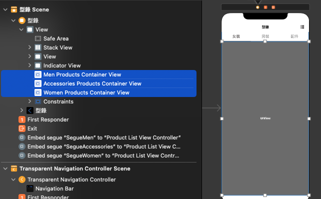

# Container view in STYLiSH


<details>
<summary style="font-size: 1.5em; color: #c1ac40"><B>Embedded Segue</B></summary>
The picture below shows that there are three container view stacked on top of each other.<br>
And if we open the connection inspector, we can see there are actually three segues connected to the view controller.<br><br>


<br><br>
<br>
This indicate that when the container is initialized along with the ProductViewController, the segue will be triggered.<br>

<br><br>

Now we have three embeded segue, we can now give each of them corresponding data, by using the prepare for segue method. Each of them will be performed when containerView loaded. And we can take advantage of that and load all the data at once.

```swift
    override func prepare(for segue: UIStoryboardSegue, sender: Any?) {
        guard let productListVC = segue.destination as? ProductListViewController else { return }
        let identifier = segue.identifier
        var provider: ProductListDataProvider?
        let marketProvider = MarketProvider(httpClient: HTTPClient.shared)
        
        if identifier == Segue.men {
            provider = ProductsProvider(productType: ProductsProvider.ProductType.men, dataProvider: marketProvider)
        } else if identifier == Segue.women {
            provider = ProductsProvider(productType: ProductsProvider.ProductType.women, dataProvider: marketProvider)
        } else if identifier == Segue.accessories {
            provider = ProductsProvider(
                productType: ProductsProvider.ProductType.accessories,
                dataProvider: marketProvider
            )
        }
        productListVC.provider = provider
    }
```
</details>

---

<br>

<details>
<summary style="font-size: 1.5em; color: #c89349"><B>Hide and seak</B></summary>

Whenever user triggered the button, we can use the tag to determine which container view should be shown.
<br>

```swift
    private func updateContainer(type: ProductType) {
        containerViews.forEach { $0.isHidden = true }
        
        switch type {
        case .men:
            menProductsContainerView.isHidden = false
        case .women:
            womenProductsContainerView.isHidden = false
        case .accessories:
            accessoriesProductsContainerView.isHidden = false
        }
    }
```
</details>

---
